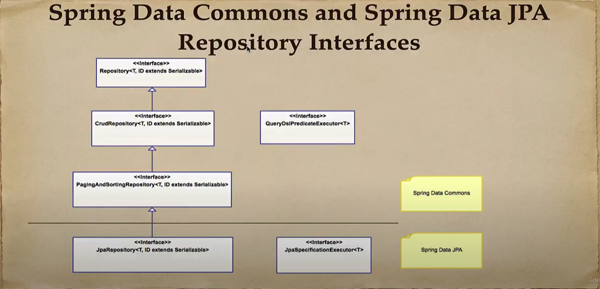
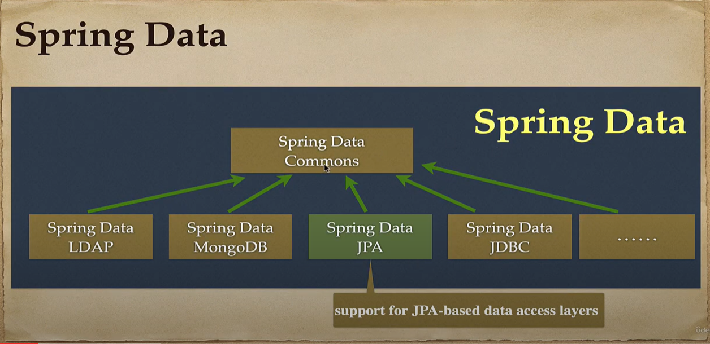
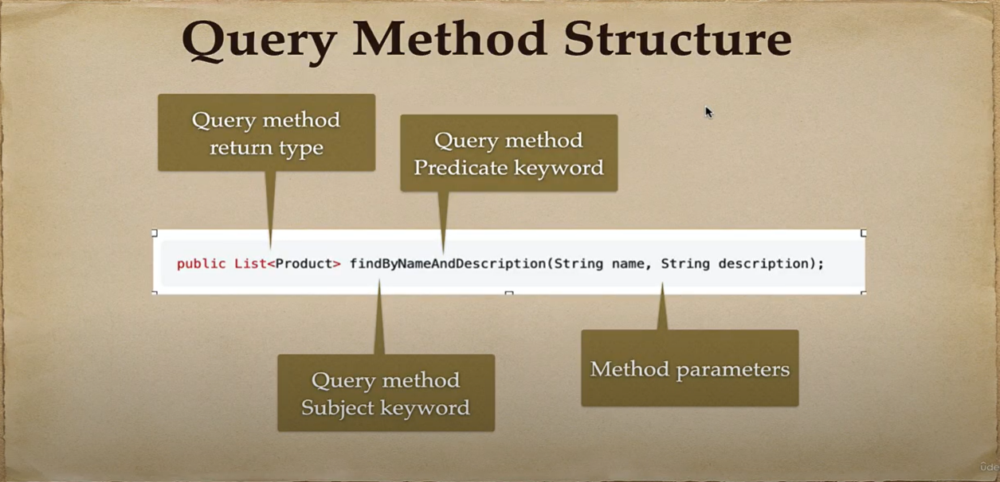
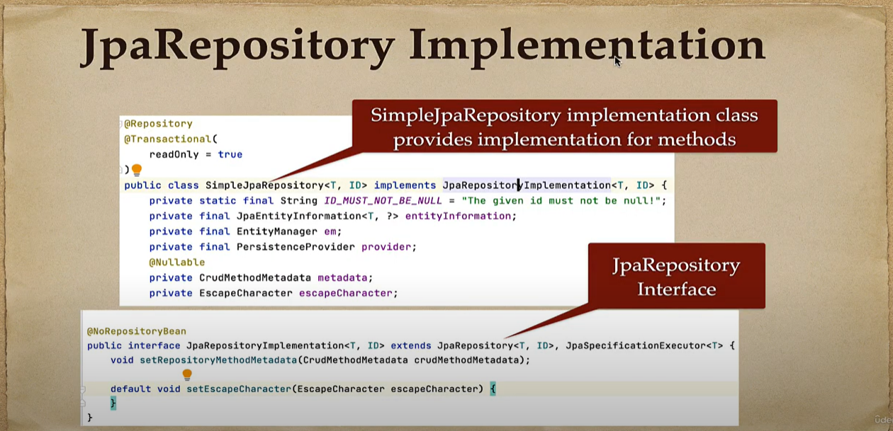
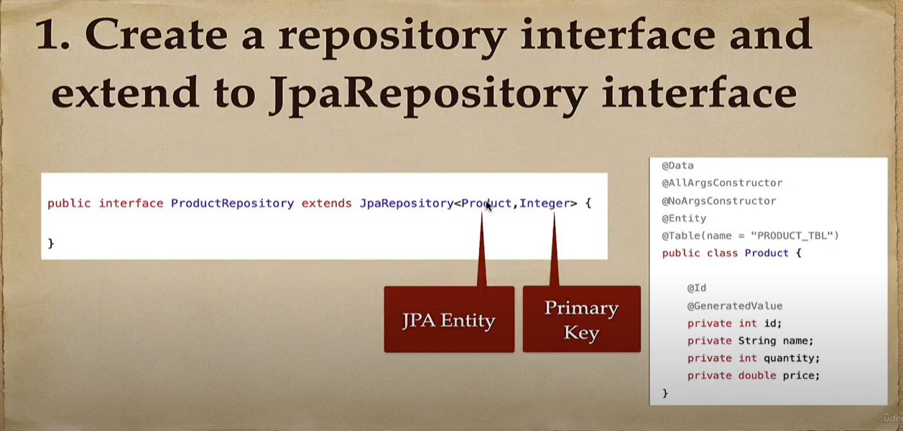
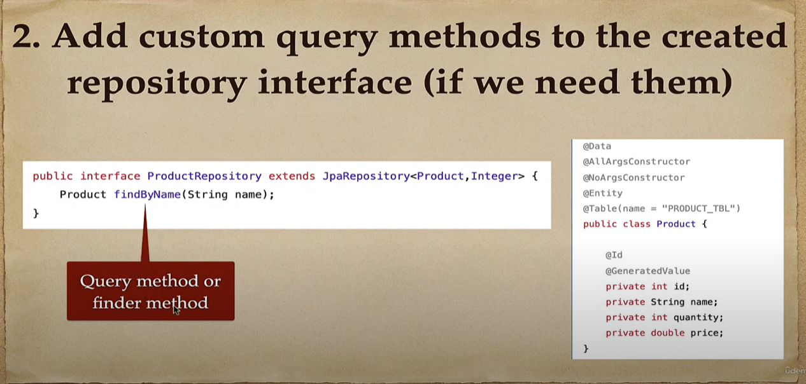
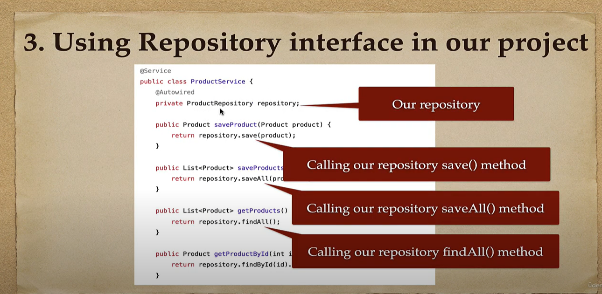
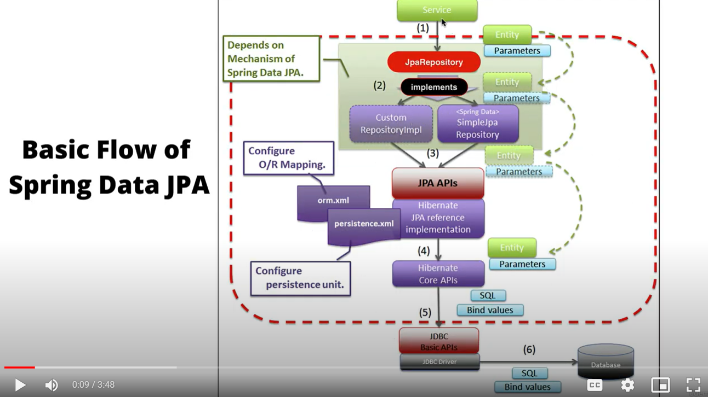

## Spring Boot Data JPA

## ORM (Object Relational Mapping)
Object-relational mapping or ORM is the programming technique to map application domain dode objects to the relational database tables.

## JPA (Jakarta Persistence API)d
Jakarta Persistence (JPA), fonrmerly known as Java Persistence API.

JPA is just a specification that facilitates object-relational mapping to manage relational data in 
java applications. It provides a platform to work directly with objects instead of using SQL statements.

## Hibernate ORM Framework

Hibernate is a java based ORM tool that provides a framework for mapping application domain objects to the
relationship database tables and vice versa.

Hibernate provides JPA implementation that mps your database records to Java objects and generates the
required SQL statements to replicate all operations to the database.

## Hibernate ORM Framework

Hibernate uses JDBC for all database communications. Hibernate uses JDBC to interact with the database.

Hibernate acts as an additional layer on top ofJDBC and enables you to implement a database-independent
persistence layer:

## JPA vs Hibernate

JPA is just a specification (no implementation) that facilitates object-relational mapping to manage
relational data in java application. It provides a platform to work directly with objects instead of 
using SQL statements.

Hibernate is a java based ORM tool that provides a framework for mapping application domain objects to
the relational database tables and vice versa.

In short, JPA provides standard specification (interfaces). Hibernate provides a implementation for JPA
specification.

## What is Spring Data JPA?

## Spring Data JPA

Reduce the amount of boilerplate code required to implement data access object (DAO) layer.

Spring Data JPA is not a JPA provider. It simply "hides" the java Persistence API (and the JPA provider)
behind its repository abstraction.

Spring Data JPA uses Hibernate as a default JPA provider.

## Spring Boot Application Architecture

## Hibernate vs Spring Data JPA

## Hibernate vs Spring Data JPA

Hibernate is a java based ORM tool that provides a framework for mapping application domain objects to
the relational database tables and vice versa.

Spring Data JPA is an abstraction layer on top of JPA to reduce the amount of boilerplate code required to 
implement data access object (DAO) layer.

Hibernate is a JPA provider (JPA specification implementation). Spring Data JPA is not a JPA provider.
It simply "hides" the Java Persistence API (and the JPA provider) behind its repository abstraction.

Spring Data JPA uses Hibernate as a default JPA Provider.
Spring Data JPA cannot work without a JPA provider.

## Basic Flow of Spring Data JPA

