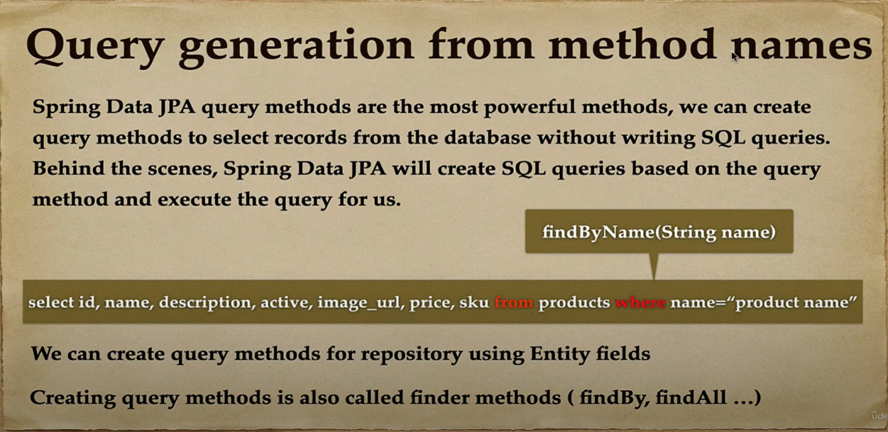
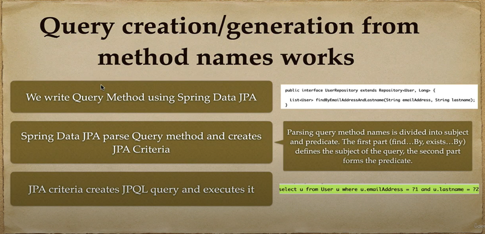

## Spring Boot Data JPA

## Spring Data Commons and Spring Data JPA Repository Interfaces

## Spring Data

## JpaRepository

## JpaRepository Implementation

## Steps to create and using Spring Data JPA Repository
1. Create a repository interface and extend to JpaRepository interface
2. Add custom query methods to the created repository interface (if we need them)
3. Inject the repository interface to another component and use the implementation that is provided automatically
by Spring Data Jpa.

## Create a repository interface and extend to JpaRepository interface

## 2. Add custom query methods to the created repository interface (if we need them)

## 3. Using Repository interface in our project
